# ENStop — Phase 1 Implementation Plan
*(Ensenada Public Transit Route Guide)*

---

## 🚀 Start Here (Execution Agent Handoff)

This plan is ready for immediate execution. Follow this checklist before writing any code:

```
☐ 1. Create project directory:
       C:\Users\core_\.gemini\antigravity\scratch\enstop\

☐ 2. Initialize local git repo:
       git init
       git commit --allow-empty -m "chore: initial commit"
       (No GitHub remote needed yet — owner will connect it later)

☐ 3. Scaffold Vite project in that directory (Agent 3 task)

☐ 4. Run: npx supabase init  (Agent 1 task, requires Docker Desktop)

☐ 5. No remote Supabase projects needed.
       All backend work runs via Supabase CLI on localhost only.
       Remote environments (dev/uat/prod) are deferred.

☐ 6. No Figma designs exist.
       Agent 4 owns all design decisions — apply the design tokens
       defined in this plan to produce a simple, clean, effective UI.
```

> [!IMPORTANT]
> Execute agents in the order shown in the **Agent Execution Order** section. Agents 1 and 2 can run in parallel. All others are sequential.

---

## 🛠️ Environment Setup (WSL Ubuntu — Clean Install)

> [!IMPORTANT]
> The execution environment is a **clean WSL2 Ubuntu instance** with nothing pre-installed. Run every step in this section **before** touching any project code. These are one-time setup commands.

---

### 0. Prerequisites on the Windows Host

Before entering WSL, ensure the following are installed on **Windows**:

- **WSL2** with Ubuntu: `wsl --install -d Ubuntu` (if not already done)
- **Docker Desktop for Windows** with WSL2 backend enabled:
  - Settings → General → "Use the WSL 2 based engine" ✅
  - Settings → Resources → WSL Integration → Enable for your Ubuntu distro ✅
  - This makes `docker` available inside WSL without installing Docker Engine natively

> [!NOTE]
> Docker Desktop on the Windows host is the recommended approach for WSL2. It avoids WSL networking complications and is the officially supported Supabase CLI setup.

---

### 1. Update System Packages

```bash
sudo apt update && sudo apt upgrade -y
```

---

### 2. Install Essential System Dependencies

```bash
sudo apt install -y \
  curl \
  git \
  build-essential \
  ca-certificates \
  gnupg \
  unzip \
  wget
```

---

### 3. Install Node.js via nvm

> [!NOTE]
> Do **not** install Node.js via `apt` — it ships an outdated version. Use `nvm` for proper version management.

```bash
# Install nvm
curl -o- https://raw.githubusercontent.com/nvm-sh/nvm/v0.39.7/install.sh | bash

# Reload shell so nvm is available
export NVM_DIR="$HOME/.nvm"
[ -s "$NVM_DIR/nvm.sh" ] && \. "$NVM_DIR/nvm.sh"

# Install Node.js 20 LTS (stable, recommended for Vite 5 + Supabase CLI)
nvm install 20
nvm use 20
nvm alias default 20

# Verify
node --version   # should print v20.x.x
npm --version    # should print 10.x.x
```

---

### 4. Configure Git

```bash
git config --global user.name "Your Name"
git config --global user.email "your@email.com"
git config --global init.defaultBranch main

# Verify
git --version
```

---

### 5. Install Supabase CLI

```bash
# Install globally via npm (requires Node 20 from step 3)
npm install -g supabase

# Verify
supabase --version   # should print 1.x.x or higher

# Confirm Docker is accessible from WSL (Docker Desktop must be running on Windows)
docker --version
docker ps            # should return empty list without error
```

> [!CAUTION]
> If `docker ps` returns a permission error or "Cannot connect to the Docker daemon", Docker Desktop is not running on Windows or WSL integration is not enabled. Fix this before proceeding — Supabase CLI requires Docker.

---

### 6. Install Playwright System Dependencies

Playwright's Chromium browser requires OS-level libraries. Install them now to avoid failures during `npm install`:

```bash
sudo apt install -y \
  libnss3 \
  libatk1.0-0 \
  libatk-bridge2.0-0 \
  libcups2 \
  libdrm2 \
  libxkbcommon0 \
  libxcomposite1 \
  libxdamage1 \
  libxfixes3 \
  libxrandr2 \
  libgbm1 \
  libasound2
```

---

### 7. Create Project Directory

```bash
mkdir -p ~/enstop
cd ~/enstop
```

> [!NOTE]
> The project lives in the WSL home directory at `~/enstop`. When accessing from Windows Explorer, the path is `\\wsl$\Ubuntu\home\<username>\enstop`.

---

### 8. Environment Verification Checklist

Run this full check before starting Agent 1:

```bash
echo "=== ENStop Environment Check ===" && \
echo "Node:      $(node --version)" && \
echo "npm:       $(npm --version)" && \
echo "Git:       $(git --version)" && \
echo "Supabase:  $(supabase --version)" && \
echo "Docker:    $(docker --version)" && \
echo "Docker OK: $(docker ps > /dev/null 2>&1 && echo YES || echo NO — start Docker Desktop on Windows)" && \
echo "================================="
```

Expected output:
```
=== ENStop Environment Check ===
Node:      v20.x.x
npm:       10.x.x
Git:       git version 2.x.x
Supabase:  1.x.x
Docker:    Docker version 2x.x.x
Docker OK: YES
=================================
```

If all lines show expected values, proceed to the **Start Here** checklist and begin Agent 1.

---

## Overview

**ENStop** is a mobile-first **Progressive Web App (PWA)** that maps Ensenada's informal "microbus" network. Users can perform client-side A-to-B routing, discover nearby stops, browse route details, and view up-to-date fare information. All spatial computation runs in the browser via Turf.js, keeping server costs at **$0** during Phase 1.

| Detail | Value |
|--------|-------|
| **Project name** | ENStop |
| **Project directory** | `C:\Users\core_\.gemini\antigravity\scratch\enstop\` |
| **Git** | Local repo only (`git init`). GitHub remote added later by owner. |
| **Backend** | Supabase CLI (local only). Remote Supabase projects deferred. |
| **Design** | No Figma. Agent 4 produces provisional UI from design tokens in this plan. |

The app launches with **1 dummy route** (synthetic but realistic Ensenada coordinates) so development can proceed immediately without waiting for real GPS tracking data. Real routes are added incrementally as tracking is completed.

---

## Decisions Resolved

| Question | Decision |
|----------|----------|
| **Android delivery** | PWA (browser-installable). No Capacitor, no Play Store. `manifest.json` + install prompt only. |
| **Launch data threshold** | 1 dummy route with complete synthetic data (stops, fares, polyline). Real routes added via data pipeline. |
| **Offline mode** | **Not in scope for Phase 1.** Reduces complexity significantly. |
| **Dynamic tariff** | Admin-managed content, not GPS-calculated. Fares are set by bus operators and updated via a lightweight admin workflow (Supabase Dashboard + documented procedure). |
| **Backend/hosting cost** | **Supabase Free Tier confirmed viable** — see cost analysis below. |
| **Local environment** | **Supabase CLI** (full local stack via Docker) + **MSW** (frontend mocking, no Docker required) — zero external service dependency for development. |
| **Project name** | **ENStop** — `C:\Users\core_\.gemini\antigravity\scratch\enstop\` |
| **Git / version control** | Local `git init` only. No GitHub remote for Phase 1. Owner connects remote later. |
| **Figma / UI design** | None. Agent 4 owns provisional design decisions based on design tokens in this plan. |
| **Remote environments** | **Deferred.** Phase 1 runs entirely on local Supabase CLI. `dev`, `uat`, `production` environments set up later. |

---

## Backend Cost Analysis

> [!NOTE]
> **Research-backed conclusion**: Supabase Free Tier is the correct choice for Phase 1 and will remain sufficient well into Phase 2 growth.

### Why Supabase Free Tier Works

The Ensenada transit dataset is tiny (~5 MB total: ~500 stops × 500 B + ~50 route shapes × 10 KB + fare tables). Against Supabase's free tier limits:

| Resource | Free Limit | Our Usage | Verdict |
|----------|-----------|-----------|---------|
| **DB Storage** | 500 MB | ~5 MB | ✅ 1% used |
| **Bandwidth** | 5 GB/month | ~750 MB @ 1,000 DAU | ✅ Comfortable |
| **API Requests** | Unlimited | ~150K/month @ 1,000 DAU | ✅ No limit |
| **PostGIS** | ✅ Included | Required | ✅ Works |
| **MAU** | 50,000 | <1,000 in Phase 1 | ✅ Far below |

**The only real risk**: Supabase pauses projects after **7 consecutive days of database inactivity**. This is trivially mitigated with a **GitHub Actions cron job** that sends a lightweight ping every 5 days — 0 extra cost.

### Upgrade Trigger
Only upgrade to Supabase Pro ($25/month) when DAU exceeds ~2,000 or if production backups become critical.

### Alternative (Zero Operational Risk)
If the 7-day pause policy is unacceptable even with the cron workaround: **Turso Free** (SQLite edge DB, 9 GB storage, 25B row reads/month, never sleeps). Trade-off: no PostGIS; spatial logic fully client-side via Turf.js and route geometries stored as GeoJSON in `TEXT` columns.

---

## Local Environment Strategy

Every developer must be able to run the **full stack locally** with no dependency on any external service (no remote Supabase, no Vercel, no internet required beyond Docker image pulls).

Two complementary layers cover different needs:

### Layer 1 — Supabase CLI (Full Stack, Requires Docker)

The [Supabase CLI](https://supabase.com/docs/guides/cli) spins up a complete, production-identical Supabase stack locally using Docker containers:

| Service | Local Port | What It Provides |
|---------|-----------|------------------|
| **PostgreSQL 15 + PostGIS** | `54322` | Identical to remote DB; runs all migrations |
| **Supabase REST API (PostgREST)** | `54321` | Auto-generated REST from schema |
| **Supabase Studio** | `54323` | Local admin UI — browse tables, run SQL, edit fares |
| **Inbucket (email)** | `54324` | Local email trap (Phase 2 prep) |
| **GoTrue (auth)** | via `54321` | Phase 2 prep; not used in Phase 1 |

**This means**: local development talks to `http://localhost:54321` instead of the remote Supabase URL. Migrations run automatically on `supabase start`. Seed data loads automatically via `supabase/seed.sql`.

#### [NEW] `supabase/config.toml`
Generated by `supabase init`. Defines local port mappings and project settings. Committed to the repo so all developers share identical config.

#### [NEW] `supabase/seed.sql`
Runs automatically after migrations on `supabase start`. Inserts the full dummy R1 route, 28 stops, categories, and all fare rules into the local DB. Every developer starts with working data immediately.

#### Developer Workflow
```bash
# One-time setup (requires Docker Desktop)
npx supabase init           # generates supabase/config.toml
npx supabase start          # pulls images, runs migrations + seed.sql

# Daily dev
npm run dev                 # Vite at localhost:5173 → points to localhost:54321

# DB changes
npx supabase db diff -f my_change   # generate migration from schema diff
npx supabase db reset               # wipe + re-run all migrations + seed (clean slate)
npx supabase db push                # push local migrations to remote (dev/uat/prod)

# Stop
npx supabase stop
```

#### [NEW] `.env.local` (gitignored)
```env
VITE_SUPABASE_URL=http://localhost:54321
VITE_SUPABASE_ANON_KEY=<local-anon-key-from-supabase-start-output>
VITE_ENV=local
```

The local anon key is deterministic and safe to share in the `README.md` (it's not a secret — it only works against `localhost`).

---

### Layer 2 — MSW (Mock Service Worker, No Docker Required)

[Mock Service Worker](https://mswjs.io/) intercepts outbound HTTP requests at the network level in the browser and in Node.js. It enables frontend development and unit testing **without any backend at all**.

#### When to Use MSW vs Supabase CLI

| Scenario | Use Supabase CLI | Use MSW |
|----------|-----------------|--------|
| Full feature development | ✅ | — |
| Unit tests (Vitest) | — | ✅ |
| Component isolation / Storybook | — | ✅ |
| CI pipeline (no Docker available) | — | ✅ |
| Simulating error states / edge cases | Partial | ✅ |
| Testing fare date logic in isolation | — | ✅ |

#### [NEW] `src/mocks/`
```
src/mocks/
├── handlers/
│   ├── routes.ts       # GET /rest/v1/routes → dummy R1 data
│   ├── stops.ts        # GET /rest/v1/stops → 28 dummy stops
│   ├── rpc.ts          # POST /rest/v1/rpc/* → nearby_stops, routes_for_stop, current_fare
│   └── index.ts        # combines all handlers
├── browser.ts          # MSW browser worker (for Vite dev mode)
├── node.ts             # MSW Node worker (for Vitest)
└── data/
    ├── routes.json     # canonical dummy data (shared by MSW + seed.sql)
    ├── stops.json
    └── fares.json
```

#### Activation
- **Browser** (opt-in via env var): `VITE_USE_MOCKS=true npm run dev` — useful when Docker isn't available or for pure UI work.
- **Vitest**: MSW Node server starts automatically in `src/test/setup.ts`. All API hooks are tested against mock handlers, not a real DB.
- **CI pipeline**: MSW is always used for unit tests; Supabase CLI is used for E2E tests (Docker is available on `ubuntu-latest` runners).

#### [NEW] `src/api/supabase.ts` (env-aware)
```typescript
import { createClient } from '@supabase/supabase-js'
import type { Database } from '../types/supabase-generated'

// Resolves to:
//   local:      http://localhost:54321  (Supabase CLI)
//   dev/uat:    https://<project>.supabase.co
//   production: https://<project>.supabase.co
const supabaseUrl = import.meta.env.VITE_SUPABASE_URL
const supabaseAnonKey = import.meta.env.VITE_SUPABASE_ANON_KEY

export const supabase = createClient<Database>(supabaseUrl, supabaseAnonKey)
```

No conditional logic needed in the client — the URL in `.env.*` does the switching.

---

### Environment Variable Files

| File | Committed | Used By | Points To |
|------|-----------|---------|----------|
| `.env.local` | ❌ (gitignored) | Local dev | Supabase CLI (`localhost:54321`) |
| `.env.test` | ✅ | Vitest | MSW (no real URL needed, but set to `http://localhost`) |
| `.env.dev` | ✅ | `develop` branch CI/CD | `ensenada-bus-dev` Supabase project |
| `.env.uat` | ✅ | `staging` branch CI/CD | `ensenada-bus-uat` Supabase project |
| `.env.production` | ✅ | `main` branch CI/CD | `ensenada-bus-prod` Supabase project |

> [!CAUTION]
> `.env.local` is always gitignored by Vite by default. Never commit local Supabase credentials or remote service keys. Remote `ANON_KEY` values for dev/uat/prod are injected via **GitHub Actions Secrets** and **Vercel Environment Variables** — not stored in committed `.env.*` files.

---

### Docker Requirement & Fallback

> [!NOTE]
> **Supabase CLI requires Docker Desktop** to be running. If a developer cannot run Docker (e.g., resource constraints), they can use **MSW-only mode** (`VITE_USE_MOCKS=true`) for all frontend work, and request a shared remote `dev` Supabase project URL from the team lead for integration testing. This is documented in `CONTRIBUTING.md`.

---

## Architecture Overview

```
────────────────────────────── LOCAL ──────────────────────────────
┌─────────────────────────────────────────────────┐
│             CLIENT (Browser / PWA)               │
│  React 18 + Vite 5 + TypeScript 5               │
│  ┌─────────────────┐  ┌──────────────────────┐  │
│  │  React-Leaflet  │  │  Turf.js (Client)    │  │
│  │  (OSM tiles)    │  │  A-to-B Routing      │  │
│  └─────────────────┘  └──────────────────────┘  │
│  ┌───────────────────────────────────────────┐   │
│  │  Supabase JS Client  ←  VITE_SUPABASE_URL │   │
│  └───────────────────────────────────────────┘   │
│  ┌───────────────────────────────────────────┐   │
│  │  MSW (optional, VITE_USE_MOCKS=true)      │   │
│  └───────────────────────────────────────────┘   │
└─────────────────────────────────────────────────┘
    │ localhost:54321 (CLI)        │ intercept (MSW)
┌───────────────────┐    ┌────────────────────────┐
│  SUPABASE CLI     │    │  MSW Node/Browser       │
│  (Docker)         │    │  Mock Handlers          │
│  Postgres+PostGIS │    │  (routes/stops/fares)   │
│  + Studio UI      │    └────────────────────────┘
└───────────────────┘

──────────────────── REMOTE (dev / uat / prod) ─────────────────────
┌─────────────────────────────────────────────────┐
│             CLIENT (Browser / PWA)               │
│  [same React app — only VITE_SUPABASE_URL differs]│
└─────────────────────────────────────────────────┘
                │  HTTPS (REST + RPC)
┌─────────────────────────────────────────────────┐
│   SUPABASE CLOUD (PostgreSQL 15 + PostGIS 3)    │
│   ensenada-bus-{dev|uat|prod}.supabase.co       │
│   Tables: categories, routes, stops,            │
│            route_stops, fare_rules              │
│   Functions: nearby_stops(), routes_for_stop()  │
│   RLS: public read-only (anon key)              │
└─────────────────────────────────────────────────┘
                │  GitHub Actions (every 5 days)
                └── ping prod → prevents 7-day pause
```

---

## Proposed Changes / Deliverables

---

### Agent 1 — Database Architect

**Deliverables**: Supabase migrations, RLS policies, spatial functions, anti-pause cron.

#### [NEW] `supabase/migrations/001_initial_schema.sql`

```sql
-- Enable PostGIS
CREATE EXTENSION IF NOT EXISTS postgis;

-- Route categories (e.g., "Centro–Maneadero")
CREATE TABLE categories (
  id         SERIAL PRIMARY KEY,
  name       TEXT NOT NULL,
  color_hex  TEXT NOT NULL  -- polyline color on map
);

-- Microbus routes
CREATE TABLE routes (
  id           SERIAL PRIMARY KEY,
  name         TEXT NOT NULL,
  short_name   TEXT NOT NULL,        -- e.g. "R1"
  category_id  INT REFERENCES categories(id),
  description  TEXT,
  geom         GEOMETRY(LineString, 4326) NOT NULL,
  direction    TEXT CHECK (direction IN ('inbound','outbound','circular')),
  is_active    BOOLEAN DEFAULT TRUE,
  created_at   TIMESTAMPTZ DEFAULT NOW()
);
CREATE INDEX routes_geom_idx ON routes USING GIST(geom);

-- Bus stops
CREATE TABLE stops (
  id           SERIAL PRIMARY KEY,
  name         TEXT NOT NULL,
  common_name  TEXT,                 -- landmark alias (e.g. "Plaza Cívica")
  geom         GEOMETRY(Point, 4326) NOT NULL,
  is_terminal  BOOLEAN DEFAULT FALSE,
  accessible   BOOLEAN DEFAULT FALSE, -- wheelchair accessible
  created_at   TIMESTAMPTZ DEFAULT NOW()
);
CREATE INDEX stops_geom_idx ON stops USING GIST(geom);

-- Ordered route ↔ stop relationships
CREATE TABLE route_stops (
  id        SERIAL PRIMARY KEY,
  route_id  INT REFERENCES routes(id) ON DELETE CASCADE,
  stop_id   INT REFERENCES stops(id) ON DELETE CASCADE,
  sequence  INT NOT NULL,
  UNIQUE(route_id, stop_id)
);

-- Fare rules (managed by admin; updated by bus operator decisions)
CREATE TABLE fare_rules (
  id              SERIAL PRIMARY KEY,
  route_id        INT REFERENCES routes(id) ON DELETE CASCADE,
  passenger_type  TEXT CHECK (passenger_type IN (
                    'normal',
                    'student_government',
                    'student_highschool',
                    'disability'
                  )),
  fare_mxn        NUMERIC(6,2) NOT NULL,
  effective_from  DATE NOT NULL DEFAULT CURRENT_DATE,
  notes           TEXT,
  updated_at      TIMESTAMPTZ DEFAULT NOW()
);
-- Always query the most recently effective fare
CREATE INDEX fare_rules_effective_idx ON fare_rules(route_id, passenger_type, effective_from DESC);
```

**Fare design note**: `effective_from` allows storing upcoming fare changes before they take effect. The app always queries `WHERE effective_from <= CURRENT_DATE ORDER BY effective_from DESC LIMIT 1` per passenger type per route.

#### [NEW] `supabase/migrations/002_rls_policies.sql`
```sql
ALTER TABLE categories  ENABLE ROW LEVEL SECURITY;
ALTER TABLE routes      ENABLE ROW LEVEL SECURITY;
ALTER TABLE stops       ENABLE ROW LEVEL SECURITY;
ALTER TABLE route_stops ENABLE ROW LEVEL SECURITY;
ALTER TABLE fare_rules  ENABLE ROW LEVEL SECURITY;

-- Public read-only for all tables
CREATE POLICY "public_read_categories"  ON categories  FOR SELECT USING (TRUE);
CREATE POLICY "public_read_routes"      ON routes      FOR SELECT USING (is_active = TRUE);
CREATE POLICY "public_read_stops"       ON stops       FOR SELECT USING (TRUE);
CREATE POLICY "public_read_route_stops" ON route_stops FOR SELECT USING (TRUE);
CREATE POLICY "public_read_fare_rules"  ON fare_rules  FOR SELECT USING (TRUE);
-- No INSERT/UPDATE/DELETE from anon key. Admin writes via service-role key only.
```

#### [NEW] `supabase/migrations/003_spatial_functions.sql`
```sql
-- Nearest stops within radius (default 500m)
CREATE OR REPLACE FUNCTION nearby_stops(
  lat FLOAT, lng FLOAT, radius_meters FLOAT DEFAULT 500
)
RETURNS SETOF stops AS $$
  SELECT * FROM stops
  WHERE ST_DWithin(
    geom::geography,
    ST_SetSRID(ST_MakePoint(lng, lat), 4326)::geography,
    radius_meters
  )
  ORDER BY geom <-> ST_SetSRID(ST_MakePoint(lng, lat), 4326)
  LIMIT 20;
$$ LANGUAGE sql STABLE;

-- Active routes serving a given stop
CREATE OR REPLACE FUNCTION routes_for_stop(p_stop_id INT)
RETURNS SETOF routes AS $$
  SELECT r.* FROM routes r
  JOIN route_stops rs ON rs.route_id = r.id
  WHERE rs.stop_id = p_stop_id AND r.is_active = TRUE;
$$ LANGUAGE sql STABLE;

-- Current effective fare for a route + passenger type
CREATE OR REPLACE FUNCTION current_fare(p_route_id INT, p_passenger_type TEXT)
RETURNS fare_rules AS $$
  SELECT * FROM fare_rules
  WHERE route_id = p_route_id
    AND passenger_type = p_passenger_type
    AND effective_from <= CURRENT_DATE
  ORDER BY effective_from DESC
  LIMIT 1;
$$ LANGUAGE sql STABLE;
```

#### [NEW] `.github/workflows/supabase-ping.yml`
```yaml
name: Supabase Anti-Pause Ping
on:
  schedule:
    - cron: '0 12 */5 * *'  # Every 5 days at noon UTC
jobs:
  ping:
    runs-on: ubuntu-latest
    steps:
      - name: Ping Supabase DB
        run: |
          curl -s "$SUPABASE_URL/rest/v1/categories?select=id&limit=1" \
            -H "apikey: $SUPABASE_ANON_KEY" \
            -H "Authorization: Bearer $SUPABASE_ANON_KEY"
        env:
          SUPABASE_URL: ${{ secrets.PROD_SUPABASE_URL }}
          SUPABASE_ANON_KEY: ${{ secrets.PROD_SUPABASE_ANON_KEY }}
```

---

### Agent 2 — Data Pipeline

**Deliverables**: GPX→GeoJSON converter CLI + complete dummy route seed data.

#### [NEW] `tools/gpx-to-geojson/`
- Node.js CLI that reads GPX/KML files from Geo Tracker (Moto Edge 40 Pro).
- Applies Ramer–Douglas–Peucker simplification via Turf.js (tolerance: 0.0001 degrees).
- Filters GPS noise (removes points > 50m/s speed between consecutive fixes).
- Outputs normalized GeoJSON `FeatureCollection` with properties: `route_id`, `direction`, `collected_at`, `raw_point_count`, `simplified_point_count`.
- Validates bounding box (Ensenada: lat 31.5–31.9, lng -116.5–-116.7).

#### [NEW] `tools/seed-db/`
- Supabase seed script (TypeScript, runs via `ts-node`).
- **Dummy Route "R1 — Centro–Chapultepec"**: 28 synthetic stops along Av. Reforma with realistic Ensenada coordinates, a full LineString polyline, and all 4 fare types populated.
- All fares reflect actual 2024 Ensenada microbus rates: Normal $13 MXN, Student (gov) $7 MXN, Student (highschool) $10 MXN, Disability $7 MXN.
- Idempotent upserts — safe to re-run.
- Separate seed files per environment: `seed.dev.ts`, `seed.uat.ts`, `seed.prod.ts`.

---

### Agent 3 — Frontend Architect

**Deliverables**: Vite project scaffold, TypeScript config, Supabase client, type definitions.

#### Project Structure

```
src/
├── api/
│   ├── supabase.ts          # Supabase client init (env-aware)
│   ├── useRoutes.ts         # React Query hook: all active routes
│   ├── useRoute.ts          # Single route + stops + current fares
│   ├── useStops.ts          # All stops
│   ├── useNearbyStops.ts    # RPC: nearby_stops(lat, lng, radius)
│   └── useRoutesForStop.ts  # RPC: routes_for_stop(stop_id)
├── components/
│   ├── Map/
│   │   ├── BusMap.tsx
│   │   ├── RoutePolyline.tsx
│   │   ├── StopMarker.tsx
│   │   └── UserLocationPin.tsx
│   ├── Routing/
│   │   ├── RoutePlanner.tsx
│   │   ├── RouteResult.tsx
│   │   └── routing.ts       # Turf.js A-to-B logic
│   ├── StopDetail/
│   │   ├── StopDrawer.tsx
│   │   ├── StopRouteList.tsx
│   │   └── CheckInButton.tsx  # Local state only (Phase 1)
│   ├── RouteDetail/
│   │   ├── RouteCard.tsx
│   │   ├── RouteStopsList.tsx
│   │   ├── FareTable.tsx      # Shows all 4 passenger types
│   │   └── TimeEstimate.tsx
│   └── UI/
│       ├── Button.tsx
│       ├── Badge.tsx
│       ├── Drawer.tsx
│       ├── Spinner.tsx
│       └── EmptyState.tsx
├── pages/
│   ├── MapPage.tsx
│   ├── RoutesPage.tsx
│   ├── RouteDetailPage.tsx
│   └── NotFoundPage.tsx
├── store/
│   ├── mapStore.ts         # Viewport, selected stop/route (Zustand)
│   └── routingStore.ts     # A/B points, computed result
├── types/
│   └── index.ts            # Route, Stop, Fare, Category, RouteStop types
├── hooks/
│   ├── useGeolocation.ts
│   └── useRoutePlanner.ts
├── styles/
│   ├── index.css
│   └── variables.css
└── main.tsx
```

#### [NEW] `src/api/supabase.ts`
```typescript
import { createClient } from '@supabase/supabase-js'
import type { Database } from '../types/supabase-generated'

const supabaseUrl = import.meta.env.VITE_SUPABASE_URL
const supabaseAnonKey = import.meta.env.VITE_SUPABASE_ANON_KEY

export const supabase = createClient<Database>(supabaseUrl, supabaseAnonKey)
```

Multi-environment: `.env.local`, `.env.dev`, `.env.uat`, `.env.production` each point to their respective Supabase project.

---

### Agent 4 — UI / Design System

**Deliverables**: CSS design tokens, component library.

#### Design Authority

> [!NOTE]
> No Figma designs exist for Phase 1. Agent 4 is the **sole design decision-maker**. Use the design tokens below as the complete specification and produce a clean, effective, mobile-first UI. Prioritize clarity and usability over decoration.

#### Design Tokens (Authoritative — Agent 4 implements these exactly)

```css
/* Color Palette — Maritime Ensenada */
--color-bg-primary:     #0D2137;   /* deep ocean navy — app background */
--color-bg-surface:     #122B47;   /* card / drawer surface */
--color-bg-elevated:    #1A3A5C;   /* modal / elevated surface */
--color-accent-warm:    #E8924A;   /* warm sand — CTAs, highlights */
--color-accent-teal:    #3DBFA8;   /* seafoam — active route, success */
--color-text-primary:   #F0F4F8;   /* primary text on dark bg */
--color-text-secondary: #8BA5BE;   /* secondary / muted text */
--color-text-inverse:   #0D2137;   /* text on light/accent backgrounds */
--color-border:         #1E3F60;   /* subtle borders */
--color-error:          #E05C5C;   /* error states */

/* Typography */
--font-heading: 'Outfit', sans-serif;
--font-body:    'Inter', sans-serif;
--font-size-xs:   12px;
--font-size-sm:   14px;
--font-size-base: 16px;
--font-size-lg:   18px;
--font-size-xl:   22px;
--font-size-2xl:  28px;

/* Spacing (4px base unit) */
--space-1:  4px;  --space-2:  8px;  --space-3: 12px;
--space-4: 16px;  --space-6: 24px;  --space-8: 32px;
--space-12: 48px; --space-16: 64px;

/* Border radius */
--radius-sm:   6px;
--radius-md:  12px;
--radius-lg:  20px;
--radius-full: 9999px;

/* Shadows */
--shadow-card: 0 4px 24px rgba(0,0,0,0.3);
--shadow-drawer: 0 -8px 40px rgba(0,0,0,0.5);

/* Breakpoints */
--bp-mobile:  375px;
--bp-tablet:  768px;
```

#### UI Conventions Agent 4 Must Follow
- All interactive elements: minimum **44×44px** touch target.
- Drawers slide up from bottom on mobile (not side panels).
- Route badges: colored pill with short name (e.g. "R1") using `category.color_hex`.
- Loading states: skeleton shimmer, not spinners, for list items.
- Error states: inline message with retry button — never blank screens.
- Map markers: small filled circles (10px) for stops; larger pulsing dot for user location.
- WCAG 2.1 AA: verify all text/background combos ≥4.5:1 contrast before shipping.

---

### Agent 5 — Map Engineer

**Deliverables**: React-Leaflet map with routes, stops, and user location.

#### Key Implementation Details
- **Tile provider**: OpenStreetMap (free, no API key). Fallback: CartoDB Positron for cleaner mobile rendering.
- **Route polylines**: Color-coded per `category.color_hex`; thicker on hover/selection (3px → 5px).
- **Stop markers**: Custom SVG pins; color matches route category; accessible `aria-label="Stop: {name}, Routes: {R1, R2}"`.
- **User location**: Pulsing dot pin using CSS animation; geolocation permission prompt on first use.
- **Map bounds**: Auto-fit to Ensenada bounding box on load; follows user location if granted.

---

### Agent 6 — Routing & Spatial Logic

**Deliverables**: Client-side A-to-B routing algorithm using Turf.js.

#### Algorithm (`src/components/Routing/routing.ts`)

```
Input: originPoint (lat/lng), destPoint (lat/lng)

1. Call nearby_stops(origin, 500m) → originStops[]
2. Call nearby_stops(dest, 500m) → destStops[]
3. For each originStop: call routes_for_stop(originStop.id) → originRoutes[]
4. For each destStop:   call routes_for_stop(destStop.id) → destRoutes[]
5. Find intersection: routes that appear in BOTH sets (shared route_id)
6. For each matching route:
   a. Fetch route_stops ordered by sequence
   b. Find originStop.sequence and destStop.sequence
   c. Validate direction: originStop.sequence < destStop.sequence
      (for circular routes, always valid)
   d. Extract sub-polyline: turf.lineSlice(originStopPoint, destStopPoint, routeLine)
   e. Compute: busDistanceKm = turf.length(subPolyline)
   f. Compute: walkOriginKm = turf.distance(originPoint, originStopPoint)
   g. Compute: walkDestKm   = turf.distance(destStopPoint, destPoint)
   h. Score: totalMinutes = (busDistanceKm/20 + (walkOriginKm+walkDestKm)/5) × 60
7. Sort by totalMinutes ASC
8. Return top 3 results
```

**Constants** (configurable):
- Average microbus speed: `20 km/h`
- Walking speed: `5 km/h`
- Stop search radius: `500m` (adjustable by user)

---

### Agent 7 — Business Logic & Fare Management

**Deliverables**: Route detail, stop detail, fare table, time estimate, admin fare update procedure.

#### Fare Display (`FareTable.tsx`)
Displays all passenger types for a route with current effective fare:

| Passenger Type | Fare (MXN) |
|---------------|-----------|
| Normal | $13.00 |
| Student (Government) | $7.00 |
| Student (High School) | $10.00 |
| Disability | $7.00 |

#### Dynamic Tariff Admin Workflow

Since fares change by operator/government decree, the update procedure is:

**Option A — Supabase Dashboard (Manual, immediate)**
1. Admin opens Supabase Dashboard → Table Editor → `fare_rules`
2. Inserts new row: `route_id`, `passenger_type`, `fare_mxn`, `effective_from = [date of change]`
3. App automatically shows new fare on/after `effective_from` date (no redeploy needed)

**Option B — Seed Script Update (Developer-assisted)**
- Admin notifies developer → developer updates `seed.prod.ts` → PR → merge → pipeline runs upsert

**Option C (Future / Phase 2)**: Admin dashboard UI with authentication — explicitly out of Phase 1 scope.

#### Check-in at Stop (Phase 1)
- "I'm at this stop" button stores current stop in local component state only.
- No backend persistence (Phase 2: user accounts).
- Used to simplify route planner: auto-fills origin field with checked-in stop.

#### Time Estimate (`TimeEstimate.tsx`)
- Displays: `🚌 ~12 min bus • 🚶 ~4 min walk`
- Walking segments shown separately (walk to origin stop, walk from dest stop).
- Disclaimer shown: "Estimated time. Actual service may vary."

---

### Agent 8 — QA Engineer

**Deliverables**: Vitest unit tests, Playwright E2E tests, accessibility scans.

#### Unit Tests (Vitest)

| Test File | Coverage Target |
|-----------|----------------|
| `routing.test.ts` | A-to-B algorithm: matching routes, direction validation, scoring |
| `fare.test.ts` | All 4 passenger types, `effective_from` date logic |
| `timeEstimate.test.ts` | Distance → minutes formula edge cases |
| `useNearbyStops.test.ts` | Hook with MSW-mocked Supabase RPC |
| `useRoutes.test.ts` | Hook with MSW-mocked Supabase REST |

**Coverage target**: ≥80% on `src/api/` and `src/components/Routing/`.

#### E2E Tests (Playwright, 375px mobile viewport)

| Spec | Scenario |
|------|----------|
| `map-loads.spec.ts` | Map renders, route polylines visible, stop markers clickable |
| `route-planner.spec.ts` | User sets A/B → gets suggestions → selects one → sees detail |
| `stop-detail.spec.ts` | Tap stop → drawer opens → shows routes + current fares |
| `route-browse.spec.ts` | Routes page lists all routes → navigate to detail → all stops shown |
| `fare-table.spec.ts` | All 4 passenger type fares display correctly |
| `accessibility.spec.ts` | `@axe-core/playwright` WCAG 2.1 AA scan on all 4 pages |
| `pwa.spec.ts` | `manifest.json` exists, app installable prompt fires |

#### Accessibility Requirements
- `aria-label` on all map markers, buttons, and drawer triggers.
- Touch targets ≥ 44×44px.
- Keyboard navigation: Route planner, stop list, drawer close.
- Screen reader announcements: route selected, stop checked-in.
- `lang="es"` on `<html>` root.
- Color is never the only differentiator (icons + text accompany route color badges).

---

### Agent 9 — DevOps

**Deliverables**: CI/CD pipeline, environments, PWA manifest, env var management, local dev setup.

#### Environments

> [!NOTE]
> **Phase 1 runs local-only.** Remote environments (`dev`, `uat`, `production`) are defined here for future setup but are **not activated** in Phase 1. The owner will create remote Supabase projects and connect GitHub when ready.

| Environment | Status | Backend | Frontend | How Activated |
|-------------|--------|---------|----------|---------------|
| `local` | ✅ **Active in Phase 1** | Supabase CLI (`localhost:54321`) | Vite (`localhost:5173`) | `npm run db:start && npm run dev` |
| `local-mock` | ✅ **Active in Phase 1** | MSW (no backend) | Vite (`localhost:5173`) | `npm run dev:mock` |
| `dev` | 🔒 Deferred | `enstop-dev.supabase.co` | Vercel Preview | Push to `develop` (future) |
| `uat` | 🔒 Deferred | `enstop-uat.supabase.co` | Vercel Preview | Push to `staging` (future) |
| `production` | 🔒 Deferred | `enstop-prod.supabase.co` | Vercel Production | Push to `main` + approval (future) |

#### Git Setup (Phase 1 — Local Only)

```bash
# Agent 9 runs this during project initialization
git init
git add .
git commit -m "chore: initial ENStop project scaffold"
# No remote origin set. Owner adds GitHub remote later:
# git remote add origin https://github.com/<owner>/enstop.git
# git push -u origin main
```

#### Branch Strategy (for future GitHub connection)
```
main          ← stable production
  └── staging ← UAT / pre-production
        └── develop ← integration
              ├── feature/*
              ├── fix/*
              └── data/*     ← new GPX route data
```

#### [NEW] `package.json` Scripts
```json
{
  "scripts": {
    "dev":            "vite",
    "dev:mock":       "VITE_USE_MOCKS=true vite",
    "dev:local":      "supabase start && vite",
    "build":          "tsc -b && vite build",
    "preview":        "vite preview",
    "test":           "vitest run",
    "test:watch":     "vitest",
    "test:coverage":  "vitest run --coverage",
    "test:e2e":       "playwright test",
    "test:e2e:ui":    "playwright test --ui",
    "db:start":       "supabase start",
    "db:stop":        "supabase stop",
    "db:reset":       "supabase db reset",
    "db:diff":        "supabase db diff",
    "db:push":        "supabase db push",
    "db:types":       "supabase gen types typescript --local > src/types/supabase-generated.ts",
    "db:studio":      "supabase studio",
    "lint":           "eslint . --ext .ts,.tsx",
    "typecheck":      "tsc --noEmit"
  }
}
```

#### [NEW] `CONTRIBUTING.md` — Local Dev Quickstart
Documents two paths for any new contributor:

**Path A (Full Stack — recommended)**
```bash
git clone <repo>
cd ensenada-bus
npm install
cp .env.local.example .env.local    # pre-filled with localhost:54321 + local anon key
npm run db:start                    # starts Supabase CLI (Docker required)
npm run dev                         # opens localhost:5173
# Visit localhost:54323 for Supabase Studio (browse data, edit fares)
```

**Path B (Frontend-only — no Docker)**
```bash
git clone <repo>
cd ensenada-bus
npm install
npm run dev:mock                     # MSW intercepts all API calls with mock data
```

#### GitHub Actions Workflows (Deferred — no GitHub remote in Phase 1)

> [!NOTE]
> CI/CD workflow files will be **created but not activated** in Phase 1. They are committed to the local repo so they are ready the moment the owner pushes to GitHub.

**`.github/workflows/ci.yml`** *(created, not yet running)*:
```
lint → typecheck → unit-tests (Vitest + MSW) → e2e-tests (Playwright + Supabase CLI) → audit → build
```

**`.github/workflows/deploy-*.yml`** *(created, not yet running)*:
- `deploy-dev.yml` — push to `develop` → Vercel Preview + dev Supabase
- `deploy-uat.yml` — push to `staging` → Vercel Preview + UAT Supabase  
- `deploy-prod.yml` — push to `main` + approval → Vercel Production + prod Supabase
- `supabase-ping.yml` — every 5 days → anti-pause ping (only relevant once remote Supabase exists)

**Phase 1 local testing runs manually:**
```bash
npm run lint && npm run typecheck   # linting
npm run test:coverage               # unit tests (MSW)
npm run db:start && npm run test:e2e  # E2E (Supabase CLI required)
npm run build                       # build check
```

#### Migration Flow (Phase 1 — Local Only)
```bash
# When schema changes:
npm run db:diff -f describe_change   # generates new migration file
npm run db:reset                     # apply all migrations + seed from scratch
npm run db:types                     # regenerate TypeScript types
git add supabase/migrations/ src/types/supabase-generated.ts
git commit -m "db: <describe change>"

# Future (once GitHub + remote Supabase exist):
# supabase db push --db-url $DEV_DB_URL
```

Migrations are versioned and idempotent — the same SQL that runs in `supabase start` will run in remote environments when they are set up.

#### Type Generation
After any schema change:
```bash
npm run db:types
# → regenerates src/types/supabase-generated.ts from local DB schema
# → always commit this file alongside the migration
```

#### PWA Configuration

**`public/manifest.json`**:
```json
{
  "name": "Rutas Ensenada",
  "short_name": "Rutas",
  "description": "Encuentra las rutas de microbus en Ensenada, BC",
  "start_url": "/",
  "display": "standalone",
  "background_color": "#0D2137",
  "theme_color": "#0D2137",
  "lang": "es",
  "icons": [
    { "src": "/icons/icon-192.png", "sizes": "192x192", "type": "image/png" },
    { "src": "/icons/icon-512.png", "sizes": "512x512", "type": "image/png" },
    { "src": "/icons/icon-512-maskable.png", "sizes": "512x512", "type": "image/png", "purpose": "maskable" }
  ]
}
```

No service worker caching (offline mode excluded from Phase 1). Install prompt only.

#### Security
- Supabase `anon` key in `VITE_SUPABASE_*` env vars — never committed.
- CSP headers via `vercel.json`: `connect-src` restricted to Supabase project URL + OSM tile domains.
- `npm audit --audit-level=high` blocks PRs with high/critical vulnerabilities.
- HTTPS enforced at Vercel layer.

---

## API Specification

**`docs/api-spec.yaml`** — OpenAPI 3.1, all endpoints via Supabase auto-REST + RPC.

| Method | Endpoint | Description |
|--------|----------|-------------|
| `GET` | `/rest/v1/routes?is_active=eq.true&select=*,category:categories(*)` | All active routes with category |
| `GET` | `/rest/v1/routes?id=eq.{id}&select=*,route_stops(*,stop:stops(*))` | Route with ordered stops |
| `GET` | `/rest/v1/stops` | All stops |
| `POST` | `/rest/v1/rpc/nearby_stops` | `{lat, lng, radius_meters}` → stops |
| `POST` | `/rest/v1/rpc/routes_for_stop` | `{p_stop_id}` → routes |
| `POST` | `/rest/v1/rpc/current_fare` | `{p_route_id, p_passenger_type}` → fare |

All responses: JSON. Auth: `Authorization: Bearer <anon_key>` header.

---

## Performance Targets

| Metric | Target | Strategy |
|--------|--------|---------|
| First Contentful Paint | < 1.5s (4G) | Vite code splitting, lazy-loaded route pages |
| Largest Contentful Paint | < 2.5s | Map initialized after UI shell renders |
| Time to Interactive | < 3s | Critical data prefetched with React Query |
| Initial JS bundle | < 200 KB gzipped | Turf.js tree-shaken (import specific functions only) |
| Lighthouse Mobile | ≥ 90 | PWA manifest, semantic HTML, no render-blocking |

---

## Agent Execution Order

```mermaid
gantt
  title Phase 1 — Agent Task Sequence
  dateFormat  X
  axisFormat  Week %s

  section Foundation (Parallel)
  Agent 1 - DB Schema + Functions    :a1, 0, 1w
  Agent 2 - Dummy Route Seed Data    :a2, 0, 1w

  section Frontend Setup
  Agent 3 - Vite + TS + Supabase    :a3, after a1, 1w
  Agent 4 - Design System + CSS     :a4, after a3, 1w

  section Core Features
  Agent 5 - Map + Leaflet           :a5, after a4, 1w
  Agent 6 - A-to-B Routing (Turf)   :a6, after a5, 1w
  Agent 7 - Route/Stop/Fare Views   :a7, after a6, 1w

  section Quality + Deployment
  Agent 8 - Tests (Vitest+PW)       :a8, after a7, 1w
  Agent 9 - CI/CD + PWA + Envs      :a9, after a8, 1w
```



---

## Verification Plan

### Local Environment Smoke Test (Every Developer, Before First PR)
```bash
npm run db:start             # Supabase CLI starts cleanly
npm run dev                  # App loads at localhost:5173 with R1 dummy data
# Open localhost:54323 → Studio shows categories, routes, stops, fare_rules tables populated
npm run db:stop

npm run dev:mock             # MSW mode: app loads with zero backend
# All routes/stops/fares visible via mock handlers
```

### Automated (Blocking CI Gates)
- `vitest run --coverage` → ≥80% on routing + API modules (runs with MSW, no Docker)
- `playwright test --project=chromium` → all specs pass on 375×812 viewport (runs against Supabase CLI in CI)
- `npm run build` → zero TypeScript errors, zero ESLint errors
- `npm audit --audit-level=high` → zero high/critical CVEs
- `supabase db push` → migrations apply cleanly to dev environment

### Manual (Pre-Production Checklist)
- [ ] `npm run db:reset` → clean DB, seed loads correctly, app still works
- [ ] `npm run db:types` → regenerated types match current schema, no TS errors
- [ ] Install PWA on Moto Edge 40 Pro via Chrome → verify touch targets, map pan/zoom
- [ ] Walk A-to-B routing flow using dummy R1 route data
- [ ] Verify all 4 fare types display correctly in `FareTable`
- [ ] Verify fare date logic: insert a future-dated fare via Studio → confirm it doesn't display yet
- [ ] Lighthouse Mobile audit in Chrome DevTools → ≥90 on Performance, Accessibility, Best Practices
- [ ] Simulate Supabase project pause → confirm cron ping workflow prevents it
- [ ] Verify CSP headers block unexpected third-party requests
